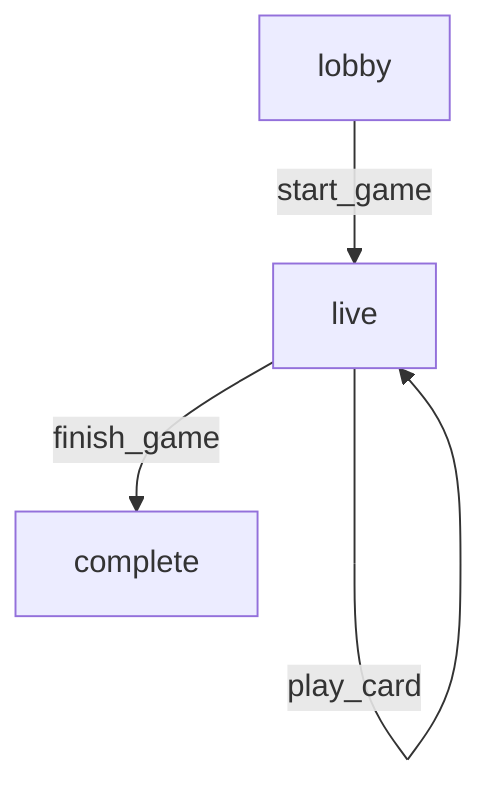

# Kadi

A multiplayer online card game platform built with Elixir and Phoenix LiveView, focused on implementing "Poker" (a card game popular in Kenya, also known as "Kadi").

## Quick Start

### Installation

- [Install Elixir](https://elixir-lang.org/install.html) (version 1.14+)
- Clone the repo: `git clone https://github.com/yourusername/kadi.git`
- Run `mix setup` to install and setup dependencies
- Run `.githooks/install.sh` to install git hooks (optional but recommended)
- Run `mix test` for a basic sanity check

### Running the Application

Start the Phoenix server:
```bash
mix phx.server
# Or with IEx console for debugging:
iex -S mix phx.server
```

Visit [`localhost:4000`](http://localhost:4000) in your browser.

---

## For New Contributors

### Understanding the Game Flow

Kadi uses a **database-driven architecture** where all game state is persisted in PostgreSQL. Here's how a typical game works:

1. **Player Registration** - Players create accounts
2. **Create Game Session** - A player creates a new game (status: "lobby")
3. **Players Join** - Other players join the game session
4. **Start Game** - Host starts the game, cards are dealt (status: "live")
5. **Gameplay** - Players take turns drawing or playing cards
6. **Game End** - Game concludes when a player plays their last card

### Interactive Console Examples

Run these commands in an IEx session (`iex -S mix`):

#### Example 1: Complete Game Flow

```elixir
# Import required modules
alias Kadi.{Accounts, CardGames, Repo}

# 1. Register players (in production, this happens via web UI)
{:ok, player1} = Accounts.register_player(%{
  email: "alice@example.com",
  password: "securepassword123"
})

{:ok, player2} = Accounts.register_player(%{
  email: "bob@example.com", 
  password: "securepassword123"
})

{:ok, player3} = Accounts.register_player(%{
  email: "charlie@example.com",
  password: "securepassword123"
})

# 2. Create a game session
{:ok, game_session} = CardGames.create_game_session(player1, %{
  short_code: "GAME123"
})

IO.inspect(game_session.status)  # => "lobby"

# 3. Other players join the game
{:ok, _} = CardGames.join_game_session(player2, game_session.id)
{:ok, _} = CardGames.join_game_session(player3, game_session.id)

# 4. Start the game (must have at least 2 players)
{:ok, started_game} = CardGames.start_game(game_session)

IO.inspect(started_game.status)  # => "live"
IO.inspect(started_game.current_turn_player_id)  # => Random player ID

# 5. Verify the game state is correct
started_game = Repo.preload(started_game, [deck: [deck_cards: :card]])

# Check each player has 4 cards
player1_cards = 
  started_game.deck.deck_cards
  |> Enum.filter(&(&1.location_type == "player_hand" && &1.player_id == player1.id))

IO.inspect(length(player1_cards))  # => 4

player2_cards = 
  started_game.deck.deck_cards
  |> Enum.filter(&(&1.location_type == "player_hand" && &1.player_id == player2.id))

IO.inspect(length(player2_cards))  # => 4

player3_cards = 
  started_game.deck.deck_cards
  |> Enum.filter(&(&1.location_type == "player_hand" && &1.player_id == player3.id))

IO.inspect(length(player3_cards))  # => 4

# Check there's a start card on the played pile
played_cards = 
  started_game.deck.deck_cards
  |> Enum.filter(&(&1.location_type == "played_stack"))

IO.inspect(length(played_cards))  # => 1 (the start card)

# Check remaining deck has cards
deck_cards = 
  started_game.deck.deck_cards
  |> Enum.filter(&(&1.location_type == "deck"))

IO.inspect(length(deck_cards))  # => 39 (52 - 12 dealt - 1 start card)

# Verify the start card is NOT a special card (2, 3, J, Q, K, A)
start_card = List.first(played_cards)
start_card = Repo.preload(start_card, :card)
IO.inspect(start_card.card.rank)  # => "4", "5", "6", "7", "8", "9", or "10"
```

#### Example 2: Querying Game State

```elixir
alias Kadi.{CardGames, Repo}

# Get a game session by ID
{:ok, game} = CardGames.get_game_session(1)

# List all games a player is in
games = CardGames.list_user_games(player1.id)
IO.inspect(length(games))  # Number of games player1 is in

# Check game details
game = Repo.preload(game, [:created_by, :current_turn_player])
IO.puts("Created by: #{game.created_by.email}")
IO.puts("Status: #{game.status}")

if game.current_turn_player do
  IO.puts("Current turn: #{game.current_turn_player.email}")
end
```

#### Example 3: Inspecting Card Distribution

```elixir
alias Kadi.{Repo}
alias Kadi.Games.{GameSession, DeckCard}

# Load a game with all associations
game = Repo.get!(GameSession, 1)
game = Repo.preload(game, [
  :created_by,
  :current_turn_player,
  game_session_players: :player,
  deck: [deck_cards: :card]
])

# Group cards by location
cards_by_location = Enum.group_by(game.deck.deck_cards, & &1.location_type)

IO.puts("Deck: #{length(cards_by_location["deck"] || [])} cards")
IO.puts("Played: #{length(cards_by_location["played_stack"] || [])} cards")
IO.puts("In hands: #{length(cards_by_location["player_hand"] || [])} cards")

# Show each player's hand count
game.game_session_players
|> Enum.each(fn gsp ->
  hand_size = 
    game.deck.deck_cards
    |> Enum.count(&(&1.location_type == "player_hand" && &1.player_id == gsp.player_id))
  
  IO.puts("#{gsp.player.email}: #{hand_size} cards")
end)
```

---

## Architecture Overview

### Database Schema

- **`players`** - User accounts with authentication
- **`game_sessions`** - Game instances (lobby, live, finished)
- **`game_session_players`** - Join table for players in games
- **`decks`** - One deck per game session
- **`cards`** - 52 shared cards (suits × ranks)
- **`deck_cards`** - Tracks card locations (deck, player_hand, played_stack)

### Key Concepts

1. **Database-Driven State** - All game state is in PostgreSQL, not in-memory
2. **Turn Order** - Players ordered by join time (`inserted_at`), wraps around
3. **Card Locations** - Cards move between: `deck` → `player_hand` → `played_stack`
4. **Real-time Updates** - Phoenix PubSub broadcasts game state changes
5. **Atomic Transactions** - Ecto.Multi ensures state consistency

### Running Tests

```bash
# Run all tests
mix test

# Run specific test file
mix test test/kadi/card_games_test.exs

# Run with warnings as errors
mix test --warnings-as-errors

# Run specific test at line number
mix test test/kadi/card_games_test.exs:42
```

### Git Hooks

The project includes a pre-commit hook that automatically runs `mix format` on staged Elixir and Phoenix files.

**Installation**:
```bash
.githooks/install.sh
```

This ensures code is properly formatted before commits. The hook will:
- Run `mix format` on staged `.ex`, `.exs`, and `.heex` files
- Prevent commit if formatting changes are needed
- Show which files need to be re-staged after formatting

---

## Game Rules (Poker/Kadi)

- **Players**: 2-6 players
- **Initial Deal**: 4 cards per player
- **Start Card**: Cannot be 2, 3, J, Q, K, or A
- **Turn Order**: Sequential, wraps around
- **Actions**: Draw a card OR play a card (not both)
- **Objective**: First to play all cards wins

### Special Cards

**Implemented**:
- **King**: Reverses turn order (clockwise ⟷ counter-clockwise). See [King Card Feature Documentation](docs/king-card-feature.md) for details.

**Coming Soon**:
- **2, 3**: Pick cards
- **Jack**: Skip next player
- **Queen / 8**: Question cards -> Need to be played in combination with an "answer" This could be:
  - another card
  - A combination of compatible cards (same suit as the question)
  - Drawing a card if the player has no compatible card
- **Ace**: Is an allowed finishing card. When a player plays it, they can request for a specific suit to be played on the next turn

---

## Current State Machine



---

## Features

### Implemented Features
- **Basic Gameplay**: Draw cards, play matching cards, turn-based mechanics
- **Real-time Updates**: Phoenix LiveView with PubSub for live game state
- **Player Authentication**: Registration, login, session management
- **King Card (Feature 006)**: Direction reversal, cardless state, auto-draw mechanics - [Full Documentation](docs/king-card-feature.md)

### Coming Soon
- Additional special cards (2, 3, Jack, Queen, Ace)
- Game completion and winner detection
- Player statistics and leaderboards

---

## Contributing

1. Check out a feature branch
2. Write tests first (TDD approach)
3. Implement the feature
4. Run `mix test` to ensure all tests pass
5. Submit a pull request

See `/specs/` directory for feature specifications and planning documents.

---

## Resources

- **Phoenix LiveView**: https://hexdocs.pm/phoenix_live_view
- **Ecto**: https://hexdocs.pm/ecto
- **Elixir**: https://elixir-lang.org/docs.html

**Prior Art**:
- [Level10](https://level10.games/) - https://github.com/dnsbty/level10
