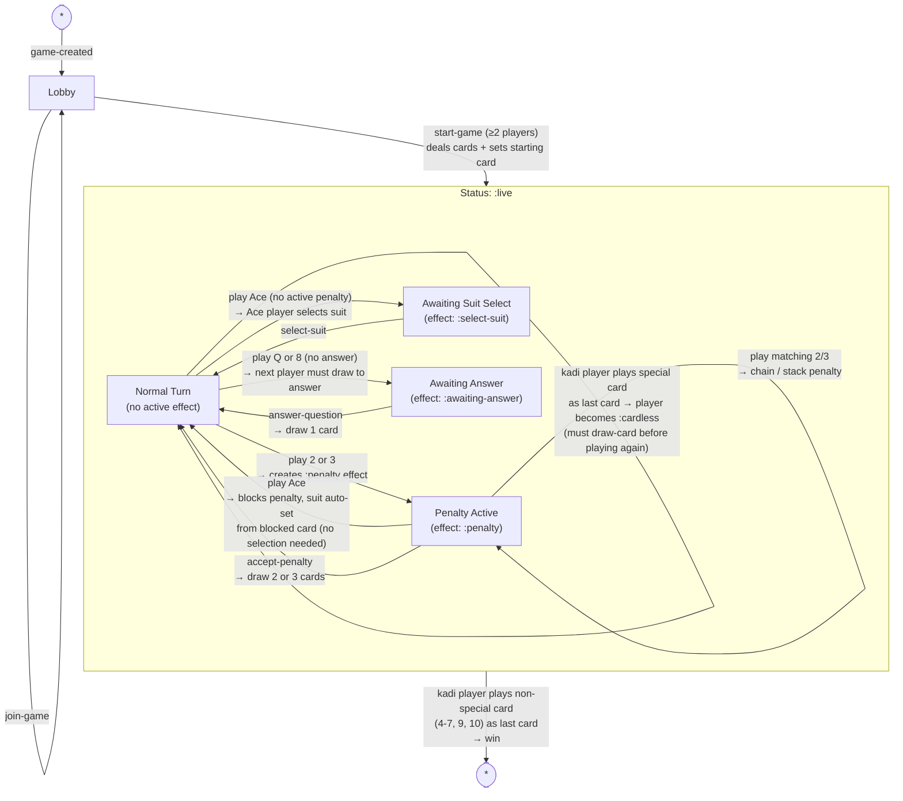

**Notes on game model:**

- **Game statuses**: `:lobby` → `:live` → `:finished` (only 3 top-level states)
- **Effects** live inside `:live` status — they constrain valid actions, not separate game states
- **Player statuses** (per-player, not game-level):
  - `:normal` — regular play
  - `:kadi` — declared; can win on next valid finish
  - `:cardless` — played a special card (K/J/Q/8/2/3/A) as their very last card; must draw before playing
- **Valid combos**: multiple Aces, multiple Jacks, multiple 2s, multiple 3s, multiple Q/8 cards; Kings cannot be combined
- **Invalid starting cards**: J, 2, 3 (Q, K, A, and regular cards are all valid starting cards)
- **Win condition**: player must be in `:kadi` status AND empty their hand with a non-special card (4-7, 9, 10)
