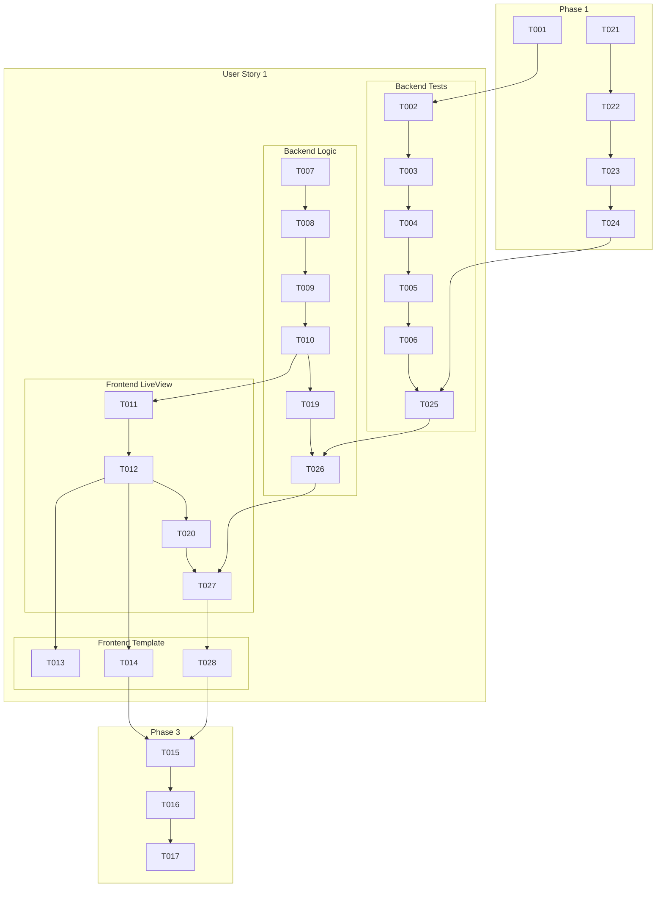

# Tasks: Deal Start Card

This document outlines the implementation tasks for the "Deal Start Card" feature, ordered by dependency.

## Implementation Strategy

The feature will be implemented in a single phase focused on User Story 1, as it is self-contained. The approach is backend-first, starting with tests for the core game logic, followed by implementation, and then updating the frontend LiveView and templates.

**MVP Scope**: The entirety of User Story 1 constitutes the MVP for this feature.

---

## Phase 1: Setup

- [X] T001 Verify Elixir and Phoenix environment is correctly set up by running `mix test`.

### Refinement: Assign Turn

- [X] T021 Generate migration to add `current_turn_player_id` to `game_sessions` table.
- [X] T022 Edit migration file to add `current_turn_player_id` as a foreign key to `players` table.
- [X] T023 Run `mix ecto.migrate`.
- [X] T024 Add `belongs_to :current_turn_player, Kadi.Accounts.Player` to `GameSession` schema in `lib/kadi/games/game_session.ex`.

---

## Phase 2: User Story 1: Game Start and Initial Deal

**Goal**: When the game starts, players see their cards, the starting card, and the deck.
**Independent Test**: Can be verified by starting a game and observing that the initial state is correctly displayed for all players.

### Backend: Tests (TDD)

- [X] T002 [US1] In `test/kadi/card_games_test.exs`, add a new `describe` block for the `start_game` logic.
- [X] T003 [US1] In `test/kadi/card_games_test.exs`, write a test to ensure `start_game/1` changes the `GameSession` status to `"live"`.
- [X] T004 [US1] In `test/kadi/card_games_test.exs`, write a test to verify that after `start_game/1`, exactly one card has its `location_type` set to `"played_stack"`.
- [X] T005 [US1] In `test/kadi/card_games_test.exs`, write a test to ensure the card in `"played_stack"` is not a special card (2, 3, J, Q, K, A).
- [X] T006 [US1] In `test/kadi/card_games_test.exs`, write a test to confirm the correct number of cards have `location_type` of `"player_hand"` for each player.
- [X] T025 [US1] Add test to `test/kadi/card_games_test.exs` to verify a random player is assigned as `current_turn_player`.

### Backend: Implementation

- [X] T007 [US1] Modify the `start_game/1` function in `lib/kadi/card_games.ex` to contain the main logic.
- [X] T008 [US1] In `lib/kadi/card_games.ex`, implement the logic to shuffle the deck and recursively find a valid starting card, avoiding special cards.
- [X] T009 [US1] In `lib/kadi/card_games.ex`, use `Ecto.Multi` to atomically update the `GameSession` status and all `DeckCard` `location_type` changes within the `start_game/1` function.
- [X] T010 [US1] In `lib/kadi/card_games.ex`, after the `Ecto.Multi` transaction succeeds, broadcast the `"game_updated"` event via `Phoenix.PubSub`.
- [X] T019 [US1] Modify `select_start_card/1` in `lib/kadi/card_games.ex` to set `order_index=1` on the starting card changeset.
- [X] T026 [US1] Modify `do_start_game` in `lib/kadi/card_games.ex` to randomly select a player and set `current_turn_player_id`.

### Frontend: LiveView Logic

- [X] T011 [US1] In `lib/kadi_web/live/game_live.ex`, update the `mount/3` function to correctly derive `@player_hand`, `@played_pile`, and `@deck_size` from the `game_session`'s preloaded associations.
- [X] T012 [US1] In `lib/kadi_web/live/game_live.ex`, implement the `handle_info/2` function for the `"game_updated"` event to refresh the socket assigns and update the view.
- [X] T020 [US1] Modify `assign_game_state/2` in `lib/kadi_web/live/game_live.ex` to sort `@played_pile` by `order_index`.
    - [X] T027 [US1] In `lib/kadi_web/live/game_live.ex`, update `assign_game_state` to preload `current_turn_player` and assign `@current_turn_player`.
### Frontend: Template

- [X] T013 [P] [US1] In `lib/kadi_web/live/game_live.html.heex`, add UI to render the top card of the played pile (where `location_type` is `"played_stack"`).
- [X] T014 [P] [US1] In `lib/kadi_web/live/game_live.html.heex`, add UI to render a representation of the draw deck, displaying the value of `@deck_size`.
    - [X] T028 [P] [US1] In `lib/kadi_web/live/game_live.html.heex`, add UI to display whose turn it is.
---

## Phase 3: Polish & Verification

- [X] T015 Run `mix format` to ensure all code is formatted.
- [X] T016 Run `mix test` to ensure all new and existing tests pass.
- [X] T017 Manually test the end-to-end game start flow in the browser to confirm real-time updates and correct UI rendering for multiple players.

---

## Dependencies

## Parallel Execution

-   Within User Story 1, once the backend logic (T007-T010, T019, T026) is complete and broadcasts a payload, the frontend tasks (T011-T014, T020, T027, T028) can be worked on in parallel.
-   The template tasks (T013, T014, T028) can be done in parallel with each other.